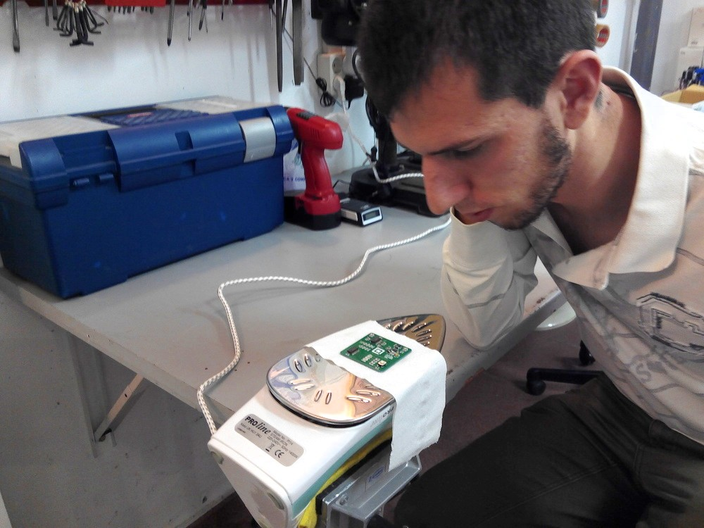

# ESP_Multi_Board (En constucción)
Diseño de una nueva placa basada en el módulo ESP8266 con conextividad WIFI y extensión para soportar dos motores DC, 8 GPIO digitales (MCP23008), 12 entradas Análogicas (MAX11605EEE+), giroscopio y acelerómetro (MPU6050)

_ESP Multi Boards_

_SMD boards can be soldered using an iron and low-temp solder paste (a.k.a. "¡soldadas con [el método de la plancha!](https://www.youtube.com/watch?v=2VqYg4uM7OA)")_

##Librerias
+ [Arduino IDE for ESP8266](http://www.arduinesp.com/ "ArduinESP")
+ [MCP23008 lib for Arduino](https://github.com/adafruit/Adafruit-MCP23008-library "MCP23008 library")

IR values
cm - val
0 - 216
2 - 130
3 - 92
4 - 73
5 - 53
6 - 40
7 - 34
10 - 21

_Testing the components before sending the PCB out for manufacture_

Authors
--
**Víctor Uceda & Carlos García**  
Club de Robótica-Mecatrónica, Universidad Autónoma de Madrid (CRM-UAM)  
<http://crm.ii.uam.es>  

License
--
License: **Attribution - Share Alike - Creative Commons (<http://creativecommons.org/licenses/by-sa/4.0/>)**  

Disclaimer  
--
This hardware/software is provided "as is", and you use the hardware/software at your own risk. Under no circumstances shall any author be liable for direct, indirect, special, incidental, or consequential damages resulting from the use, misuse, or inability to use this hardware/software, even if the authors have been advised of the possibility of such damages.  

